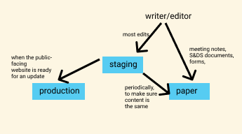

# revisiting-dubois

This is _Revisiting Du Bois_, a website bringing Du Bois' visualizations to
modern day.

### Branches

There are three main Git branches for this project: _production_, _staging_, and
_paper_.

The _staging_ and _production_ branches are versions of each other, and both
represent the main website. The _staging_ branch is a development environment to
work in, while the _production_ branch represents the deployed version of the
site.

The _paper_ branch is created off of the _staging_ branch, and holds the text as
submitted for my (Nathan Kim's) senior capstone final report in Statistics &
Data Science, and some notes as were used in working on the project during the
Fall of 2021.

The idea in this branching structure is that there are several common resources
that all three will share: this README, datasets, markdown files, and so on.
However, they often won't require the exact same version -- the paper will
probably be more academic or dry than the website, and the production and
staging versions need to be kept separate to maintain work while keeping the
site deployed and stable.

### Directory structure

- **content**: Contains .md files used to generate text on the website or the
  paper.
- **public**: contains the index.html and some assets used in producing the
  website
- **src**: contains most of the JavaScript code used to produce the website
- **notes**: only available on the _paper_ branch of the repository; holds
  meeting notes and planning documents for the project.

### Technical notes

This is a React app scaffolded by `create-react-app`. Viewers are welcome to
download the repo and view the project status through `npm install` followed by
`npm start` (you must have Node and npm installed for this to work).

Most of the visualizations from this project are planned to be completed with
d3.js and the ggdubois R package (under construction). Some of the UI components
of the website are planned to be completed with three.js and React Spring, and
the design of the library will be completed mostly with the Material-UI library
in JavaScript.

### Workflow

Make edits on the _staging_ branch. Merge to the _paper_ branches periodically
and to the _production_ branch when the public-facing website is ready to
receive an update (i.e. the _production_ branch post-merge should still be in a
usable and publishable state).

Make edits to the paper branch if they have to deal with paper-specific items:
deadlines, forms, other paperwork.

Do not make edits to the production branch directly.

